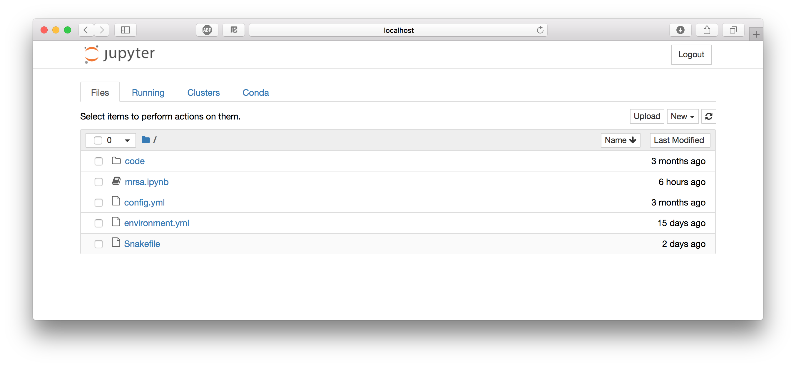
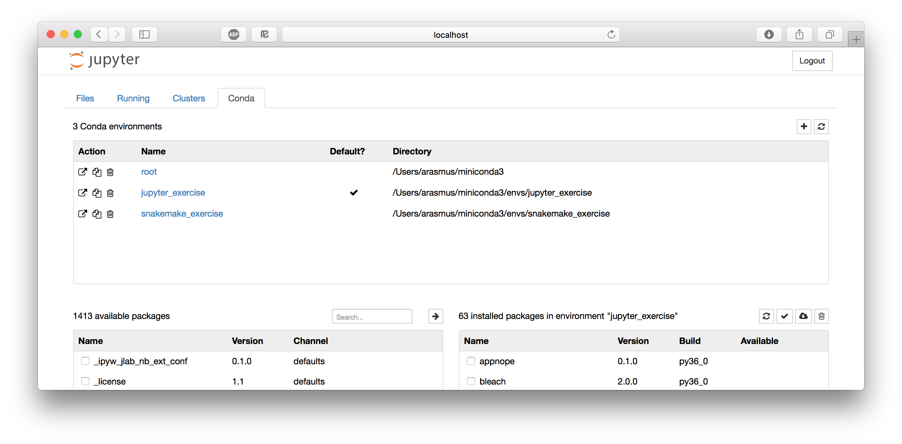
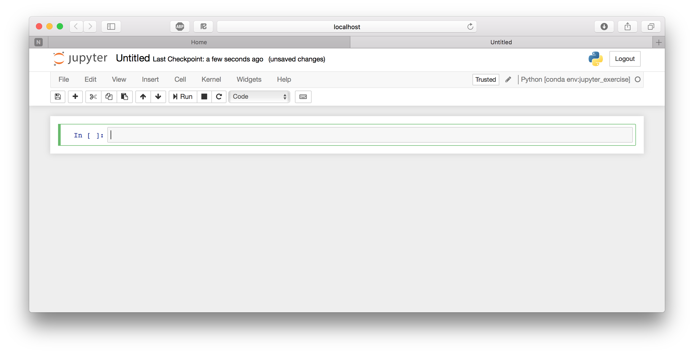

# The XXI century lab book

You have received an e-mail from a good colleague.


!!! note "email"
    Hi!
    
    The other day my friend Ptolemy told me about a "nebulous mass in the breast of Cancer". I observed it with my new telescope and I could resolve about 40 individual stars! This is amazing, and it could be a good topic for a paper. If you have time, please see if you can find anything interesting in this region. 
 
    R.A. 130.025 deg  
    Dec. 19.9833 deg
    
    Best regards,
    
      Galileo

You think it would be a good idea to explore the stellar population on this area. Because you are not sure what to expect you would like to try different approaches, so you decide to start a Jupyter notebook and explore a star catalog around those coordinates...

<h3>Objectives and scope</h3>

In this section we will see the value of Jupyter notebooks as a dynamic tool for exploratory analysis. We will learn how to initialize and navigate through notebooks, the basic structure and syntax to use a Jupyter notebook, the notebook cells and the Magic commands. As an example, we will do an exploratory analysis of a star population from the *[Gaia](https://sci.esa.int/web/gaia)* catalog.


<!---
Nice resources:

https://jupyter.org/try


-->

## Introduction to Jupyter notebooks
The Jupyter Notebook is an open-source web application that allows you to create and share documents that contain code, equations, visualizations and text. The functionality is partly overlapping with R Markdown (see the [tutorial](rmarkdown.md)), in that they both use markdown and code chunks to generate reports that integrate results of computations with the code that generated them. Jupyter Notebook comes from the Python community while R Markdown was developed by RStudio, but you could use most common programming languages in either alternative. In practice though, it's quite common that R developers use Jupyter but probably not very common that Python developers use RStudio.

### What are Jupyter notebooks for?
An excellent question! Some applications could be:

* Python is lacking a really good IDE for doing exploratory scientific data analysis, like RStudio or Matlab. Some people use it simply as an alternative for that.
* The community around Jupyter notebooks is large and dynamic, and there are tons of tools for sharing, displaying or interacting with notebooks.
* An early ambition with Jupyter notebooks, and its predecessor IPython notebooks, was to be analogous to the lab notebook used in a wet lab. It would allow the data scientist to document her day-to-day work and interweave results, ideas, and hypotheses with the code. From a reproducibility perspective, this is one of the main advantages.
* Jupyter notebooks can be used, just as R Markdown, to provide a tighter connection between your data and your results by integrating results of computations with the code that generated them. They can also do this in an interactive way that makes them very appealing for sharing with others.

As always, the best way is to try it out yourself and decide what to use it for!

### Tell me more
* The [Jupyter project site](http://jupyter.org) contains a lot of information and inspiration.
* The [Jupyter Notebook documentation](https://jupyter-notebook.readthedocs.io/en/stable/).
* A [guide](http://ipywidgets.readthedocs.io/en/stable/index.html) to using widgets for creating interactive notebooks.

!!! attention "A note on nomenclature"
    * Jupyter: a project to develop open-source software, open-standards, and services for interactive computing across dozens of programming languages. Lives at [jupyter.org](jupyter.org).
    * Jupyter Notebook: A web application that you use for creating and managing notebooks. One of the outputs of the Jupyter project.
    * Jupyter Lab: A web application that you use for creating and managing notebooks. One of the outputs of the Jupyter project.
    * Jupyter notebook: The actual `.ipynb` file that constitutes your notebook.

# Set up
This tutorial depends on files from the course Bitbucket repo. Take a look at the [intro](tutorial_intro.md) for instructions on how to set it up if you haven't done so already. Then open up a terminal and go to `reproducible_research_course/jupyter`.

## Install Jupyter Notebook
If you have done the [Conda tutorial](conda.md) you should know how to define an environment and install packages using Conda. Create an environment containing the following packages from the `conda-forge` channel. Don't forget to activate the environment.

* `jupyter`: for running everything
* `nb_conda`: for integrating Conda with Jupyter Notebook
* `matplotlib`, `ipywidgets`, `mpld3`, and `seaborn`: for generating plots
* `pandas`: for working with data frames and generating tables

!!! attention
    If you are doing these exercises through a Docker container you also need the run the following:
    ```bash
    mkdir -p -m 700 /root/.jupyter/ && \
    echo "c.NotebookApp.ip = '0.0.0.0'" >> /root/.jupyter/jupyter_notebook_config.py
    ```


# Practical exercise
## The Jupyter Notebook dashboard
One thing that sets Jupyter Notebook apart from what you might be used to is that it's a web application, i.e. you edit and run your code from your browser. But first you have to start the Jupyter Notebook server.

```no-highlight
$ jupyter notebook --allow-root
[I 18:02:26.722 NotebookApp] Serving notebooks from local directory: /Users/arasmus/Documents/projects/reproducible_research_course/jupyter
[I 18:02:26.723 NotebookApp] 0 active kernels
[I 18:02:26.723 NotebookApp] The Jupyter Notebook is running at:
[I 18:02:26.723 NotebookApp] http://localhost:8888/?token=e03f10ccb40efc3c6154358593c410a139b76acf2cae785c
[I 18:02:26.723 NotebookApp] Use Control-C to stop this server and shut down all kernels (twice to skip confirmation).
[C 18:02:26.724 NotebookApp]

    Copy/paste this URL into your browser when you connect for the first time,
    to login with a token:
        http://localhost:8888/?token=e03f10ccb40efc3c6154358593c410a139b76acf2cae785c
[I 18:02:27.209 NotebookApp] Accepting one-time-token-authenticated connection from ::1
```

Jupyter Notebook probably opened up a web browser for you automatically, otherwise go to the address specified in the message in the terminal. Note that the server is running locally (as [http://localhost:8888](http://localhost:8888)) so this does not require that you have an active internet connection. Also note that it says:

```no-highlight
Serving notebooks from local directory: /Users/arasmus/Documents/projects/reproducible_research_course/jupyter.
```

Everything you do in your Notebook session will be stored in this directory, so you won't lose any work if you shut down the server.



What you're looking at is the Notebook dashboard. This is where you manage your files, notebooks, and kernels. The Files tab shows the files in your directory. If you've done the other tutorials the file names should look familiar; they are the files needed for running the RNA-seq workflow in Snakemake. The Running tab keeps track of all your processes. The third tab, Clusters, is used for parallel computing and won't be discussed further in this tutorial. The Conda tab lets us control our Conda environments. Let's take a quick look at that. You can see that I'm currently in the `jupyter_exercise` environment.



Let's start by creating an empty notebook by selecting the Files tab and clicking New > Notebook > Python [conda env:jupyter_exercise]. This will open up a new tab or window looking like this:



!!! tip
    If you want to start Jupyter Notebooks on a cluster that you SSH to you have to do some port forwarding:
    ```bash
    ssh me@rackham.uppmax.uu.se -L8888:localhost:8888
    jupyter notebook --ip 0.0.0.0 --no-browser
    ```

## The very basics
Jupyter notebooks are made up out of cells, and you are currently standing in the first cell in your notebook. The fact that it has a green border indicates that it's in "Edit mode", so you can write stuff in it. 
A blue border indicates "Command mode" (see below).
Cells in Jupyter notebooks can be of two types: markdown or code.

* **Markdown** - These cells contain static material such as captions, text, lists, images and so on. You express this using Markdown, which is a lightweight markup language. Markdown documents can then be converted to other formats for viewing (the document you're reading now is written in Markdown and then converted to HTML). The format is discussed a little more in detail in the [R Markdown tutorial](rmarkdown.md). Jupyter Notebook uses a dialect of Markdown called Github Flavored Markdown, which is described [here](https://guides.github.com/features/mastering-markdown/).
* **Code** - These are the cells that actually do something, just as code chunks do in R Markdown. You can write code in dozens of languages and all do all kinds of clever tricks. You then run the code cell and any output the code generates, such as text or figures, will be displayed beneath the cell. We will get back to this in much more detail, but for now it's enough to understand that code cells are for executing code that is interpreted by a kernel (in this case the Python version in your Conda environment).

Before we continue, here are some shortcuts that can be useful. Note that they are only applicable when in command mode (blue frames). Most of them are also available from the menus.
These shortcuts are also available from the **Help** menu in your notebook (there's even an option there to edit shortcuts).

* ++enter++: enter Edit mode
* ++escape++: enter Command mode
* ++ctrl+enter++: run the cell
* ++shift+enter++: run the cell and select the cell below
* ++alt+enter++: run the cell and insert a new cell below
* ++ctrl+s++: save the notebook
* ++tab++: for code completion or indentation
* m/y: toggle between Markdown and Code cells
* d-d: delete a cell
* a/b: insert cells above/below current cell
* x/c/v: cut/copy/paste cells
* o: toggle output of current cell

### Some Markdown basics
Let's use our first cell to create a header. Change the format from 
Code to Markdown in the drop-down list above the cell. Double click on 
the cell to enter editing mode (green frame) and input "# My notebook" 
("#" is used in Markdown for header 1). Run the cell with Shift-Enter. 
Tada!

Markdown is a simple way to structure your notebook into sections with
descriptive notes, lists, links, images etc.

Below are some examples of what you can do in markdown. Paste all or parts
of it into one or more cells in your notebook to see how it renders. Make 
sure you set the cell type to Markdown.

```
## Introduction
In this notebook I will try out some of the **fantastic** concepts of Jupyter Notebooks.

## Markdown basics
Examples of text attributes are:

* *italics*
* **bold**
* `monospace`

Sections can be separated by horizontal lines.

---

Blockquotes can be added, for instance to insert a Monty Python quote:

    Spam! 
    Spam! 
    Spam! 
    Spam!

See [here](https://jupyter-notebook.readthedocs.io/en/stable/examples/Notebook/Working%20With%20Markdown%20Cells.html) for more information.    
```

### Writing code
Now let's write some code! Since we chose a Python kernel, Python would be the native language to run in a cell. Enter this code in the second cell and run it:

```python
print("Hello world!")
```

Note how the output is displayed below the cell. This interactive way of working is one of the things that sets Jupyter Notebook apart from RStudio and R Markdown. R Markdown is typically rendered top-to-bottom in one run, while you work *in* a Jupyter notebook in a different way. This has partly changed with newer versions of RStudio, but it's probably still how most people use the two tools. Another indication of this is that there is no (good) way to hide the code cells if you want to render your Jupyter notebook to a cleaner looking report (for a publication for example).

What **is** a Jupyter notebook? Let's look a little at the notebook we're currently working in. Jupyter Notebook saves it every minute or so, so you will already have it available. We can be a little meta and do this from within the notebook itself. We do it by running some shell commands in the third code cell instead of Python code. This very handy functionality is possible by prepending the command with `!`. Try `!ls` to list the files in the current directory.

Aha, we have a new file called `Untitled.ipynb`! This is our notebook. Look at the first ten lines of the file by using `!head Untitled.ipynb`. Seems like it's just a plain old JSON file. Since it's a text file it's suitable for version control with for example Git. It turns out that Github and Jupyter notebooks are the best of friends, as we will see more of later. This switching between languages and whatever-works mentality is very prominent within the Jupyter notebook community.

Variables defined in cells become variables in the global namespace. You can therefore share information between cells. Try to define a function or variable in one cell and use it in the next. For example:

```python
def print_me(str):
  print(str)
```

and

```python
print_me("Hi!")
```

Your notebook should now look something like this.


The focus here is not on how to write Markdown or Python; you can make really pretty notebooks with Markdown and you can code whatever you want with Python. Rather, we will focus on the Jupyter Notebook features that allow you to do a little more than that.

!!! note "Quick recap"
    In this section we've learned:

    * That a Jupyter notebook consists of a series of cells, and that they can be either markdown or code cells.
    * That we execute the code in a code cell with the kernel that we chose when opening the notebook.
    * We can run shell commands by prepending them with `!`.
    * A Jupyter notebook is simply a text file in JSON format.

## Magics
Magics constitute a simple command language that significantly extends the power of Jupyter notebooks. There are two types of magics:

* Line magics - Commands that are prepended by "%", and whose arguments only extend to the end of the line.
* Cell magics - Commands that start with `%%` and then applies to the whole cell. Must be written on the first line of a cell.

Now list all available magics with `%lsmagic` (which itself is a magic). You add a question mark to a magic to show the help (e.g. `%lsmagic?`). Some of them act as shortcuts for commonly used shell commands (`%ls`, `%cp`, `%cat`, ..). Others are useful for debugging and optimizing your code (`%timeit`, `%debug`, `%prun`, ..).

A very useful magic, in particular when using shell commands a lot in your work, is `%%capture`. This will capture the stdout/stderr of any code cell and store them in a Python object. Run `%%capture?` to display the help and try to understand how it works. Try it out with either some Python code, other magics or shell commands.

??? note "Click to see one example"
    ```no-highlight
    %%capture output
    %%bash
    echo "Print to stdout"
    echo "Print to stderr" >&2
    ```

    and in another cell

    ```python
    print("stdout:" + output.stdout)
    print("stderr:" + output.stderr)
    ```


The `%%script` magic is used for specifying a program (bash, perl, ruby, ..) with which to run the code (similar to a shebang). For some languages it's possible to use these shortcuts:

* `%%ruby`
* `%%perl`
* `%%bash`
* `%%html`
* `%%latex`
* `%%R` (here you have to first install the rpy2 extension, for example with Conda, and then load with `%load_ext rpy2.ipython`)

Try this out if you know any of the languages above. Otherwise you can always try to print the quadratic formula with LaTeX!
```no-highlight
\begin{array}{*{20}c} {x = \frac{{ - b \pm \sqrt {b^2 - 4ac} }}{{2a}}} & {{\rm{when}}} & {ax^2 + bx + c = 0} \\ \end{array}
```

Python's favorite library for plotting, matplotlib, has its own magic as well: `%matplotlib`. Try out the code below, and you should hopefully get a pretty sine wave.

```python
%matplotlib inline
import numpy as np
import matplotlib.pyplot as plt
x = np.linspace(0,3*np.pi,100)
y = np.sin(x)
fig = plt.figure()
ax = fig.add_subplot(111)
line, = plt.plot(x, y, 'r-')
fig.canvas.draw()
```

By default rendering is done as rasterized images which can make the quality poor. To render 
in scalable vector graphics format add the following line magic

```python
%config InlineBackend.figure_format = 'svg'
``` 

Try it by adding it to the cell with the lineplot and run it again. 

!!! tip
    The `%matplotlib inline` and `%config InlineBackend.figure_format = 'svg'` line 
    magics are only required once per notebook. You could for instance 
    add them to the first cell where you import matplotlib for plotting.

!!! tip
    You can capture the output of some magics directly like this:
    ```python
    my_dir = %pwd
    print(my_dir)
    ```

## Exploring results from the MRSA workflow in a Jupyter notebook
As you might remember from the [intro](tutorial_intro.md), we are attempting 
to understand how lytic bacteriophages can be used as a future therapy 
for the multiresistant bacteria MRSA (methicillin-resistant _Staphylococcus aureus_). 
We have already defined the project environment in the [Conda tutorial](conda.md) 
and set up the workflow in the [Snakemake tutorial](snakemake.md). Here 
we explore the results from a the snakemake workflow in a Jupyter notebook
 as an example of how you can document your day-to-day work as a dry lab scientist.  
We will first create a report similar to the one in the [R Markdown tutorial](rmarkdown.md) 
then generate and visualize read coverage across samples for the _S. aureus_ genome.

### Update the current environment

First update your current jupyter conda environment using the `environment.yml` file:

!!! attention
    Run the conda update command below in your terminal (not in the 
     notebook) with the jupyter exercise environment active.

```
conda env update -f environment.yml
``` 

### Open a new notebook
If you look at the Jupyter dashboard in your browser there should be a 
notebook called `mrsa_notebook.ipynb`. Now open the notebook with File > Open.

!!! tip
    Using what you've learned about markdown in notebooks, add headers 
    and descriptive text to subdivide sections as you add them. This will
    help you train how to structure and keep note of your work with a 
    notebook.

You will see that the notebook contains only two cells: one with some 
import statements and one with two function definitions. We'll come back 
to those later. Now, run the cells and add a new empty cell to the notebook. 
Typically the snakemake workflow will be executed from a terminal but let's 
try to actually run the workflow directly from within the Jupyter notebook. 

In the current directory you'll find the necessary `Snakefile` and `config.yml` 
to run the workflow. In an empty cell in your notebook, add code to 
run the workflow then run the cell.     


......
